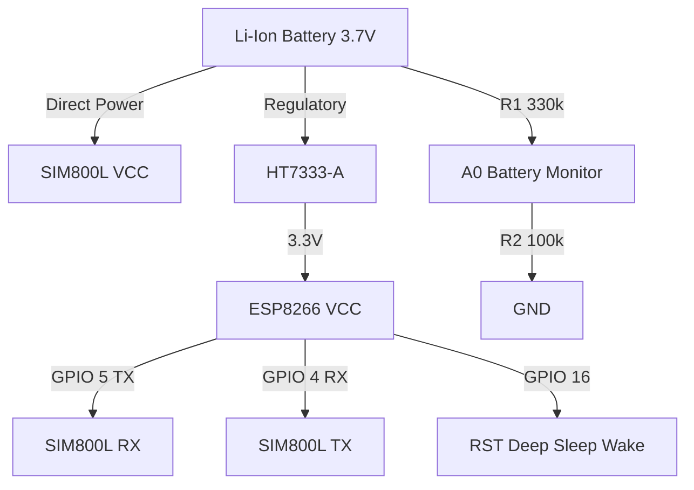

# 🛰️ NanoTracker-24/7

   

> **Sentinel-Class Asset Monitoring System**  
> *An ultra-low-power, deep-sleep enabled telemetry solution using cellular triangulation (LBS).*

---

## 📖 Executive Summary

**NanoTracker-24/7** is an industrial-grade firmware designed for the **ESP8266 (ESP-12F)** microcontroller paired with the **SIM800L GSM module**. It bypasses power-hungry GPS modules in favor of **LBS (Location-Based Services)**, utilizing cellular tower triangulation to determine position.

Engineered for longevity, the system operates on a **99% Deep Sleep duty cycle**, waking only to transmit critical telemetry (Location + Battery Voltage) before returning to a micro-amp hibernation state. It features **Over-The-Air (SMS) configuration**, allowing dynamic adjustment of reporting intervals without physical access to the device.

---

## ✨ System Capabilities

| Feature | Description |
| :--- | :--- |
| **🔋 Ultra-Low Power** | WiFi radio hard-disabled. SIM800L managed via `AT+CSCLK=2`. Sub-mA sleep current. |
| **📍 LBS Triangulation** | GPS-free location tracking using Cell ID (CID) and Location Area Code (LAC). Works indoors/underground. |
| **📡 Dual-Reporting** | Simultaneously reports telemetry to the User (Asset Owner) and the Logistics Company (Central Monitoring). |
| **⚡ Battery Telemetry** | High-precision voltage monitoring (0-4.2V) reported with every heartbeat. |
| **🛡️ Fail-Safe Logic** | Auto-recovery from network timeouts and watchdog timers for unrecoverable loops. |

---

## 🛠 Hardware Architecture

### Bill of Materials (BOM)

| Component | Specification | Function |
| :--- | :--- | :--- |
| **MCU** | ESP8266 (ESP-12F) | Central logic processor. |
| **GSM Modem** | SIM800L | 2G Quad-band GPRS module. |
| **Regulator** | HT7333-A | 3.3V LDO (Low Quiescent Current). |
| **Power Storage** | 18650 Li-Ion | 3.7V - 4.2V Nominal Voltage. |
| **Capacitor** | 1000µF / 10V | Buffer for GSM transmission bursts. |

### 🔌 Interconnect Diagram



> **⚠️ CRITICAL: Deep Sleep Wake-Up Connection**
> *   **NodeMCU / Wemos D1 Mini**: Connect a jumper wire between **D0** (GPIO 16) and **RST**.
> *   **Bare ESP-12F**: Solder a wire or use a 470Ω-1kΩ resistor between **GPIO 16** and **RST**.
> *   *Without this connection, the device will sleep forever and never wake up!*

---

## 📲 Remote Configuration Protocol

The device listens for SMS commands immediately upon waking. Usage: Send an SMS to the device number.

| Command Payload | Mode Name | Interval | Use Case |
| :--- | :--- | :--- | :--- |
| **`MODE:TRACK`** | 🚨 **Recovery Mode** | **60s** | Asset is moving or lost. High-frequency updates. |
| **`MODE:SAVE`** | 💤 **Sentry Mode** | **3600s** | Default. Hourly heartbeat. Max battery life. |

*Note: Changes persist in EEPROM across reboots.*

---

## � Installation & Setup

1.  **Hardware Assembly**: Follow the wiring diagram strictly. Ensure a common ground.
2.  **IDE Setup**:
    *   Install **Arduino IDE**.
    *   Add ESP8266 Board Manager URL.
    *   Install `ESP8266WiFi` and `EEPROM` libraries (Built-in).
3.  **Code Configuration**:
    *   Open `NanoTracker_24_7.ino`.
    *   Update `PHONE_NUMBER` with your master mobile number.
    *   (Optional) Calibrate `R1` / `R2` values in `getBatteryStatus()` if using different resistors.
4.  **Flash Firmware**:
    *   Select Board: `NodeMCU 1.0` or `Generic ESP8266 Module`.
    *   Upload Speed: `921600`.
    *   **Upload!**

---

## 📊 Data Interpretation

The standard telemetry SMS format:
text
Tracker Info:
LAC: 6699 (1A2B)
CID: 15437 (3C4D)
Link: http://www.opencellid.org/
Batt: 4.12V
```
### 🧠 Understanding the Data
The tracker provides cellular network identifiers in **Decimal (Hex)** format:
*   **LAC (Location Area Code)**: Identifies a large group of cell towers (like a neighborhood or district).
*   **CID (Cell ID)**: Identifies the *specific* cell tower your device is connected to.

By combining **LAC + CID + MCC (Country Code) + MNC (Network Code)**, we can pinpoint the exact tower location using a public database.

### 📍 Decoding Directions
1.  **Find your MCC/MNC**: Google "MCC MNC list [Your Country]" (e.g., India is 404/405).
2.  **Visit**: [OpenCelliD](https://www.opencellid.org/) or [CellMapper](https://www.cellmapper.net/).
3.  **Enter Data**:
    *   **MCC**: (e.g., 404)
    *   **MNC**: (e.g., 45)
    *   **LAC**: Use the first number (Decimal) from the SMS (e.g., `6699`).
    *   **CID**: Use the first number (Decimal) from the SMS (e.g., `15437`).
4.  **Result**: The map will show the approximate location of the tracker (based on the tower).

### ℹ️ Did You Know?
*   **GPS vs LBS**: GPS is precise (5-10 meters) but drains battery quickly and fails indoors. **LBS (Cell Tower Triangulation)** is less precise (500m - 2km) but works **indoors, underground, and inside shipping containers**, using a tiny fraction of the power.
*   **Deep Sleep**: This device can theoretically last for months on a single charge because it spends 99.9% of its time completely powered down.

---

## 📜 License

This project is open-source software licensed under the **MIT License**.

---
*Built with ❤️ by Shivam Maurya*
